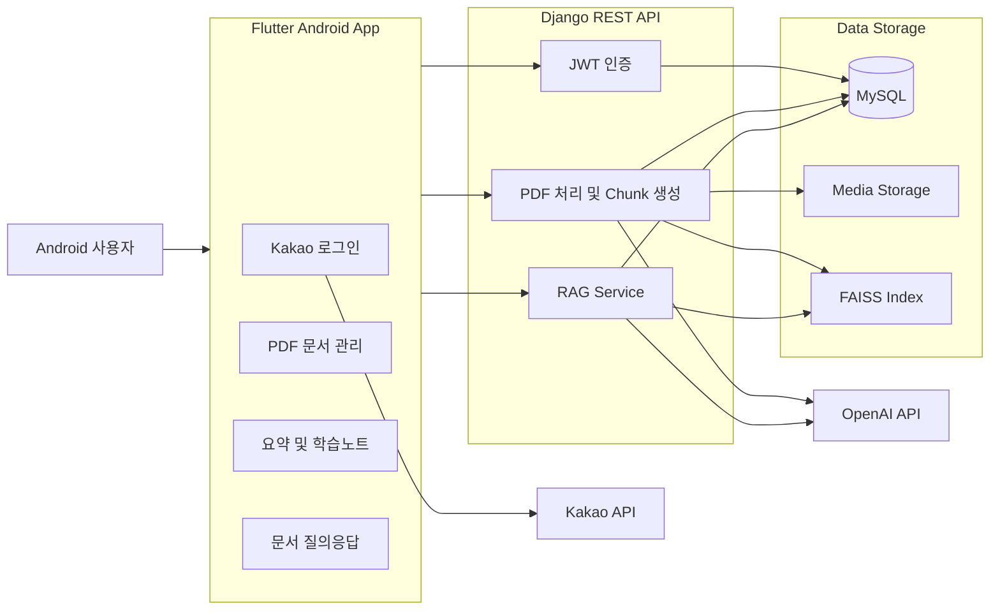

# Let Me Help You

Let Me Help You는 강의 자료 PDF를 등록하면 문서 내용을 분석하여 **AI 요약, 학습노트 생성, 문서 기반 질의응답**을 제공하는 Android 학습 지원 애플리케이션입니다.

PDF에서 텍스트를 추출하고 문서를 Chunk 단위로 분할한 뒤, OpenAI Embedding과 FAISS Vector Search를 이용해 문서의 관련 내용을 검색합니다. 검색된 문맥을 기반으로 답변을 생성하는 RAG 구조를 적용하여, 일반적인 AI 답변이 아니라 **사용자가 등록한 강의 자료에 근거한 학습 기능**을 제공하도록 구현했습니다.

---

## 주요 기능

### 회원 및 인증

- Kakao OAuth 기반 로그인
- Kakao 사용자 정보 기반 회원 등록 및 조회
- Django REST Framework Simple JWT 기반 인증
- Access Token 및 Refresh Token 발급
- Access Token 만료 시 자동 갱신
- Flutter Secure Storage를 이용한 Token 저장
- 인증 사용자만 문서 및 AI 기능 접근 가능

### PDF 문서 관리

- Android 기기에서 PDF 파일 선택
- PDF 파일 서버 업로드
- 등록된 문서 목록 조회
- 문서 상세 조회
- 문서 이름 변경 및 삭제
- 업로드 파일과 문서 정보 관리

### PDF 분석 및 인제스트

- PyMuPDF를 이용한 PDF 텍스트 추출
- 추출된 텍스트를 Chunk 단위로 분할
- Chunk별 데이터베이스 저장
- OpenAI Embedding을 이용한 Vector 생성
- 문서별 FAISS Index 및 Metadata 생성
- 문서별 검색 데이터 분리 관리

### AI 문서 요약

- PDF 전체 내용을 기반으로 핵심 내용 요약
- OpenAI Chat API를 이용한 자연어 요약 생성
- 생성된 요약 결과를 애플리케이션 화면에 표시

### AI 학습노트

- 문서 내용을 학습하기 쉬운 형태로 재구성
- 핵심 개념과 세부 내용 정리
- Markdown 형식의 학습노트 생성
- 학습노트 작성에 사용된 참고 Chunk 제공
- PDF 페이지 이미지와 관련 학습 내용 연결

### RAG 기반 질의응답

- 등록한 PDF에 대한 사용자 질문 입력
- 질문을 Embedding Vector로 변환
- FAISS를 이용한 유사 Chunk 검색
- 검색된 문맥을 기반으로 OpenAI 답변 생성
- FAISS 검색 실패 시 데이터베이스 Chunk 기반 문맥 사용
- 문서 내용에 근거한 질의응답 제공

---

## 기술 스택

| 영역 | 기술 |
| --- | --- |
| Mobile | Flutter, Dart |
| Target Platform | Android |
| UI | Flutter Material, Markdown Renderer |
| HTTP Client | Dio |
| PDF | File Picker, Syncfusion Flutter PDF Viewer |
| Authentication | Kakao OAuth, Simple JWT |
| Token Storage | Flutter Secure Storage |
| Backend | Python, Django, Django REST Framework |
| Database | MySQL |
| PDF Processing | PyMuPDF |
| AI | OpenAI Chat API, OpenAI Embedding API |
| Vector Search | FAISS |
| Image Processing | Pillow |
| Collaboration | Git, GitHub |

---

## 시스템 구조



Flutter Android 애플리케이션은 Django REST API와 통신합니다.

Django Backend는 사용자와 문서 정보를 MySQL에 저장하고, 업로드된 PDF와 생성된 페이지 이미지를 Media 디렉터리에서 관리합니다.

PDF에서 추출한 Chunk는 MySQL에 저장하며, OpenAI Embedding으로 생성한 Vector는 문서별 FAISS Index로 관리합니다.

---

## RAG 처리 흐름

```text
PDF 파일 선택
→ PDF 서버 업로드
→ PyMuPDF 텍스트 추출
→ 텍스트 Chunk 분할
→ Chunk 데이터베이스 저장
→ OpenAI Embedding 생성
→ FAISS Index 저장
→ 사용자 질문 Embedding 생성
→ 관련 Chunk 검색
→ 검색된 문맥을 OpenAI에 전달
→ 문서 기반 답변 생성
```

### 문서 인제스트

PDF를 업로드하면 검색과 AI 기능에 사용할 데이터를 생성합니다.

```text
PDF 읽기
→ 페이지별 텍스트 추출
→ Chunk 분할
→ DocumentChunk 저장
→ Embedding 생성
→ FAISS Index 생성
```

### 문서 검색

사용자의 질문을 Vector로 변환하고 해당 문서의 FAISS Index에서 의미적으로 유사한 Chunk를 검색합니다.

```text
사용자 질문
→ 질문 Embedding
→ FAISS 유사도 검색
→ 관련 Chunk 반환
```

### 답변 생성

검색된 Chunk를 문맥으로 사용하여 OpenAI Chat API에 답변 생성을 요청합니다.

```text
사용자 질문 + 검색된 문서 문맥
→ OpenAI Chat API
→ PDF 내용에 근거한 답변
```

---

## 인증 구조

Kakao OAuth 인증 후 Django Backend에서 서비스 전용 JWT를 발급하는 구조입니다.

```text
Kakao 로그인
→ Kakao Access Token 발급
→ Flutter에서 Kakao Token 전달
→ Backend에서 Kakao 사용자 검증
→ 사용자 조회 또는 생성
→ Simple JWT Access/Refresh Token 발급
→ Flutter Secure Storage에 Token 저장
```

이후 인증이 필요한 API 요청에는 Access Token을 포함합니다.

```http
Authorization: Bearer {ACCESS_TOKEN}
```

Access Token이 만료되어 `401 Unauthorized`가 발생하면 Refresh Token을 사용하여 Access Token을 갱신한 뒤 기존 요청을 다시 수행합니다.

```text
API 요청
→ Access Token 만료
→ 401 응답
→ Access Token 갱신
→ 기존 요청 재시도
```

OpenAI API Key와 Django Secret Key는 Android 애플리케이션에 포함하지 않고 Backend 환경변수에서만 관리합니다.

---

## 주요 도메인

| 도메인 | 역할 |
| --- | --- |
| User | 사용자 정보와 Kakao 계정 연동 관리 |
| Document | 업로드한 PDF 문서 정보 관리 |
| DocumentChunk | PDF에서 추출한 분할 텍스트 관리 |
| DocumentImage | 문서에서 추출한 이미지 관리 |
| DocumentPageImage | 학습노트에 사용할 PDF 페이지 이미지 관리 |
| QuestionAnswer | 문서 기반 질문과 답변 기록 관리 |
| FAISS Index | 문서 Chunk의 Embedding Vector 검색 |
| Token | Access Token과 Refresh Token 기반 인증 |

---

## 주요 API

### 인증

```http
POST /api/auth/kakao/
POST /api/auth/refresh/
```

### 문서 관리

```http
GET    /api/docs/
GET    /api/docs/{documentId}/
POST   /api/files/upload/
POST   /api/files/ingest/
POST   /api/ingest/
DELETE /api/docs/{documentId}/
```

### AI 기능

```http
POST /api/summarize/
POST /api/summarize/notes/
POST /api/ask-gpt/
```

### 학습노트 페이지

```http
POST /api/notes/snapshots/
POST /api/pages/generate/
GET  /api/pages/{documentId}/
```

인증이 필요한 API는 JWT 검증을 통과한 요청만 처리합니다.

---

## 프로젝트 구조

```text
lecture-summary-app
├── backend-rag
│   ├── manage.py
│   ├── requirements.txt
│   ├── .env.example
│   ├── lmhu
│   │   ├── migrations
│   │   ├── models.py
│   │   ├── serializers.py
│   │   ├── urls.py
│   │   ├── views.py
│   │   └── utils.py
│   └── lmhu_project
│       ├── settings.py
│       ├── urls.py
│       ├── asgi.py
│       └── wsgi.py
├── frontend-flutter
│   ├── android
│   ├── assets
│   ├── lib
│   │   ├── screens
│   │   ├── api_client.dart
│   │   ├── config.dart
│   │   ├── main.dart
│   │   └── session_manager.dart
│   ├── pubspec.yaml
│   └── analysis_options.yaml
├── .gitignore
└── README.md
```

다음 로컬 실행 데이터는 Git에 포함하지 않습니다.

```text
backend-rag/.env
backend-rag/venv
backend-rag/media
backend-rag/faiss
backend-rag/db.sqlite3
frontend-flutter/android/local.properties
```

---

## 환경 변수

`backend-rag/.env.example`을 복사하여 `.env`를 생성한 뒤 필요한 값을 설정합니다.

```env
DJANGO_SECRET_KEY=
DJANGO_DEBUG=false
DJANGO_ALLOWED_HOSTS=localhost,127.0.0.1

DB_NAME=
DB_USER=
DB_PASSWORD=
DB_HOST=
DB_PORT=3306

OPENAI_API_KEY=
EMBED_MODEL=text-embedding-3-small
USE_RAG=true

CORS_ALLOWED_ORIGINS=
```

주요 설정 항목:

- Django Secret Key
- MySQL 접속 정보
- OpenAI API Key
- Embedding Model
- 허용 Host 및 Origin
- RAG 활성화 여부

실제 Secret이 포함된 `.env` 파일은 Git에 커밋하지 않습니다.

---

## Kakao 로그인 설정

Kakao Developers에서 Android 애플리케이션을 등록한 뒤 다음 정보를 설정해야 합니다.

- Android Package Name
- Native App Key
- Android Key Hash

공개용 예제 설정은 다음 파일에서 확인할 수 있습니다.

```text
frontend-flutter/android/local.properties.example
```

실제 설정은 Git에서 제외되는 `local.properties`에 작성합니다.

```properties
flutter.sdk=C:\\path\\to\\flutter
kakao.native.app.key=YOUR_KAKAO_NATIVE_APP_KEY
```

---

## 실행 방법

### Backend

```powershell
cd backend-rag
python -m venv venv
.\venv\Scripts\Activate.ps1
pip install -r requirements.txt
Copy-Item .env.example .env
python manage.py migrate
python manage.py runserver 0.0.0.0:8000
```

실행 전 `.env`에 MySQL, OpenAI API Key와 Django 설정을 입력해야 합니다.

### Flutter Android

```powershell
cd frontend-flutter
flutter pub get
```

Android Emulator:

```powershell
flutter run `
  --dart-define=API_BASE_URL=http://10.0.2.2:8000 `
  --dart-define=KAKAO_NATIVE_APP_KEY=YOUR_KAKAO_NATIVE_APP_KEY
```

실제 Android 기기에서는 `API_BASE_URL`을 Backend가 실행 중인 컴퓨터의 로컬 IP 주소로 변경합니다.

```powershell
flutter run `
  --dart-define=API_BASE_URL=http://YOUR_LOCAL_IP:8000 `
  --dart-define=KAKAO_NATIVE_APP_KEY=YOUR_KAKAO_NATIVE_APP_KEY
```

Backend 컴퓨터와 Android 기기는 동일한 네트워크에 연결되어 있어야 합니다.

---

## 데이터 저장 구조

| 저장 위치 | 데이터 |
| --- | --- |
| MySQL | 사용자, 문서, Chunk, 질문 및 답변 |
| `backend-rag/media` | 업로드 PDF 및 생성된 페이지 이미지 |
| `backend-rag/faiss` | 문서별 FAISS Index와 Metadata |
| Flutter Secure Storage | Access Token 및 Refresh Token |

FAISS 파일은 문서별로 생성됩니다.

```text
faiss/doc_{documentId}.index
faiss/doc_{documentId}.meta.npy
```

업로드 PDF, FAISS 파일, 데이터베이스와 사용자 인증 정보는 Git에 포함하지 않습니다.

---

## 구현 결과

실제 PDF를 이용해 다음 흐름을 검증했습니다.

```text
PDF 업로드
→ PDF 텍스트 추출
→ Chunk 생성
→ OpenAI Embedding
→ FAISS Index 생성
→ AI 요약
→ 학습노트 생성
→ 문서 기반 질의응답
```

검증 과정에서 PDF에서 추출한 Chunk 수와 FAISS에 저장된 Vector 수가 일치하는 것을 확인했으며, 생성된 FAISS Index를 이용한 문서 기반 질의응답이 정상적으로 수행되는 것을 확인했습니다.

---

## 테스트

```powershell
# Django 설정 검사
cd backend-rag
python manage.py check

# Django 테스트
python manage.py test

# Flutter 정적 분석
cd ../frontend-flutter
flutter analyze
```

---

## 주의사항

- 실제 `.env` 파일을 Git에 커밋하지 않습니다.
- OpenAI API Key를 Flutter 코드에 포함하지 않습니다.
- Kakao Key와 SDK 경로가 포함된 `local.properties`를 커밋하지 않습니다.
- 사용자 업로드 PDF, Media와 FAISS 파일을 Git에 포함하지 않습니다.
- OpenAI API 사용 전 Billing과 Credit 잔액을 확인해야 합니다.
- 동일한 PDF를 반복적으로 업로드하거나 인제스트하면 API 사용량이 증가할 수 있습니다.